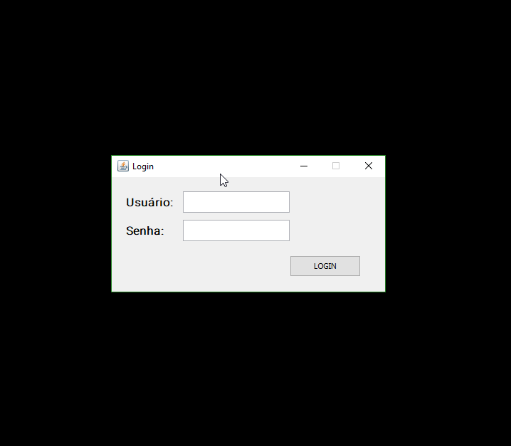
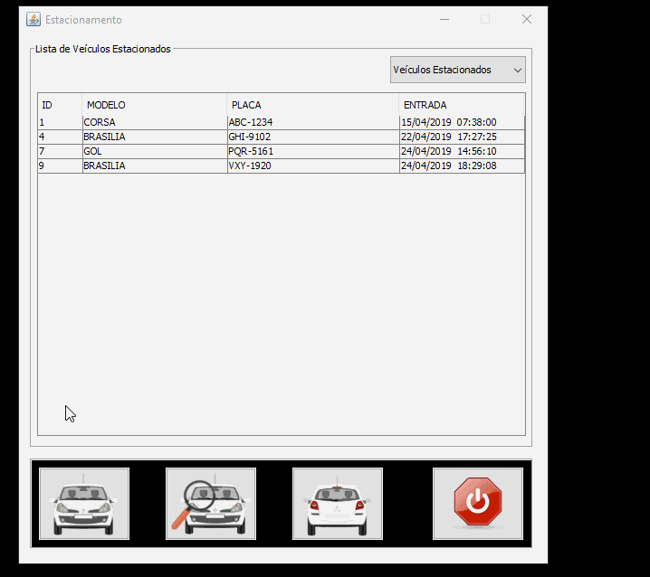
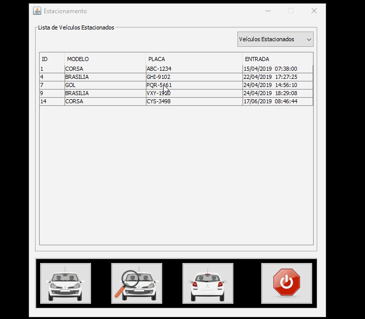

# Estacionamento-Desktop-Java
A Java Desktop Application
---

## Proposal and Requirements
The main objective was to create, through a hypothetical situation, a vehicle control system for a parking lot, where the operator could have freedom to register customers and view the parking lots, as well as control the amount of charge per hour. 
The Project was built to practice the concepts of object oriented programming and Java SE methods, as the MVC pattern, learned in SENAI Prof. Vicente Amatto technical school.

In this way, the project should focus on creating a Java Desktop CRUD in its direct interaction with MySQL, and should:

- Store vehicle information, including current date and time of entrance and exit;

- Generate proof of vehicle and customer data at the time of entry;

- Enable the editing of the customer's name or vehicle license plate;

- Store prices per hour and other hours, as tolerance;

- Calculate the payment amount at the withdrawal of the vehicle;

- Display a report on the main screen containing the list of the vehicles that made payment and the daily yield;

- Validate all data entry fields.
---

## Database
**To store the magic**

MySQL was chosed to build the dabatase, that include 3 tables:

- tbl_usuario, for authentication

- tbl_movimentacao, to regist every vehicle and it's information

- tbl_valor, to store the billing amount, current and past values
---

## Functionalities
**The potentials**

### Login

The login frame is simple, but eficient. Shows the basic concept of login, and has two users registred in the database:

Login: gerente
Password: gerente2019

Login: operador
Password: operador2019

### Create

It's possible to insert a new vehicle adding the license plate and vehicle model.

### Update

It's possible to update the license plate and the model, but never the date and time or the payment value.

### Delete

To remove the vehicle, just push the button. It's gonna show the payment value and the current exit date and time.

*Everything made with a lot of curiosity and programming passion*
